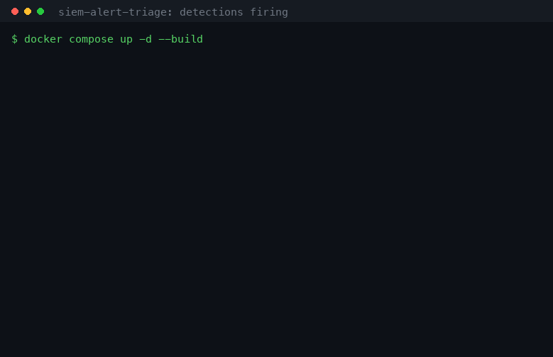
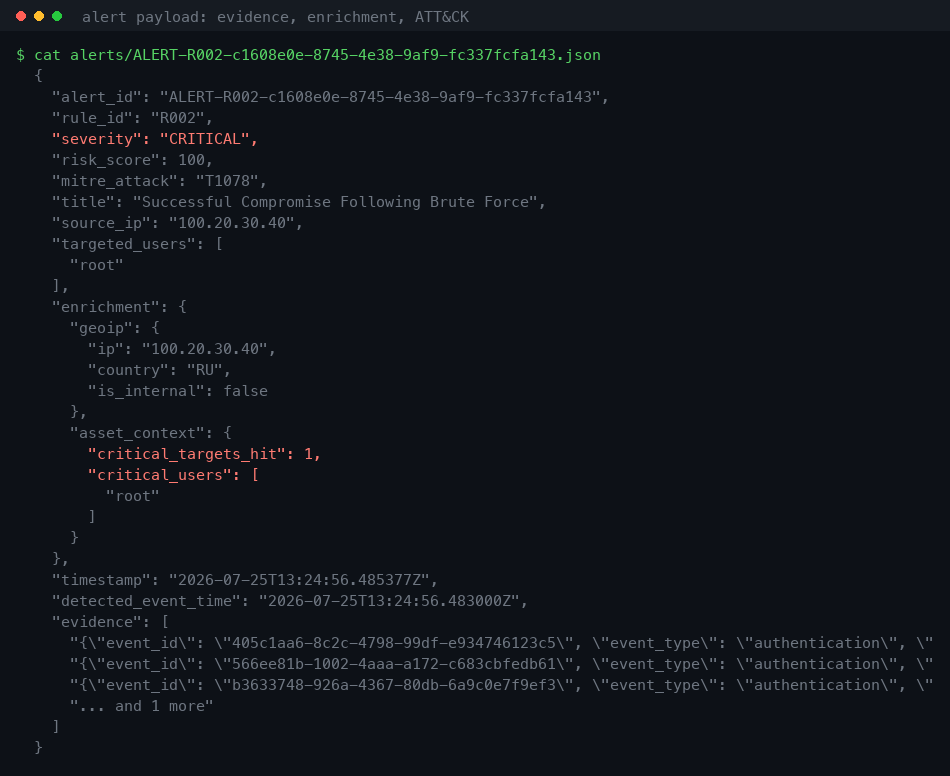
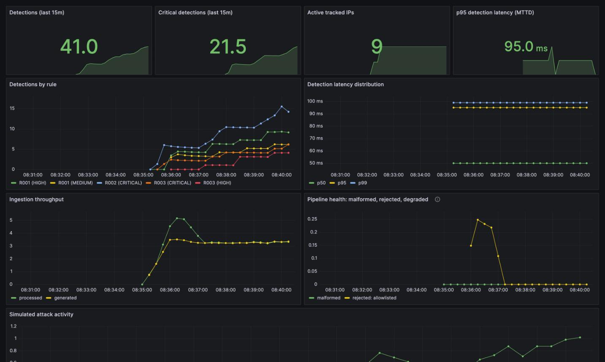
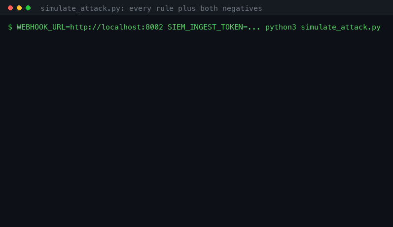
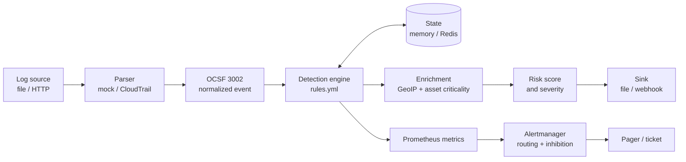
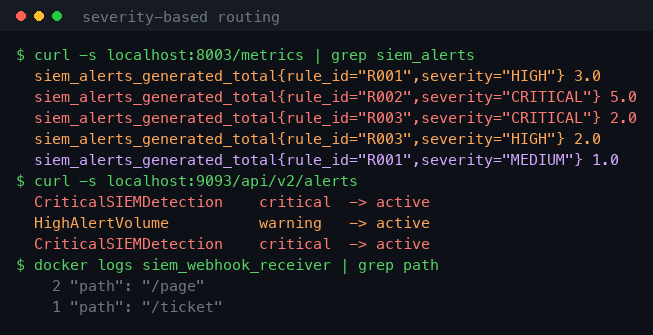

<div align="center">

  [](https://github.com/jessn-dev/siem-alert-triage/actions/workflows/ci.yml)
  [](https://opensource.org/licenses/MIT)
  [](https://www.python.org/downloads/release/python-3130/)
  [](https://www.docker.com/)

  
  
  
  
  
  
</div>

# Cloud-agnostic SIEM detection and alerting pipeline

A containerized detection pipeline for authentication logs. It normalizes events
into the OCSF Authentication schema, evaluates them against YAML rules over
event-time sliding windows, scores each finding with runtime enrichment, and
routes the result through Prometheus and Alertmanager.

Nothing in it is tied to a cloud provider. Sources, sinks, state, and parsers sit
behind interfaces you pick with environment variables.



## Highlights

- 🔍 Three correlation rules mapped to MITRE ATT&CK, written in YAML rather than Python
- ⏱️ Event-time sliding windows that survive cloud ingestion lag, clock skew, and replay
- 🧭 Severity derived at runtime from GeoIP and asset criticality, so the same rule pages differently depending on context
- 🔌 Sources, sinks, state, and parsers behind interfaces, swapped with one environment variable
- 🧾 Alerts carry the raw events that triggered them, so triage does not start with a grep
- 📡 Deadman switch plus rules for the harder case where the pipeline is alive and no longer receiving
- 🔐 Authenticated ingest with constant-time token comparison, no credential in version control
- ✅ 78 tests, plus CI checks on PromQL, Alertmanager config, and rendered Kubernetes manifests

## Contents

- [Running it locally](#running-it-locally)
- [How it works](#how-it-works)
- [Repository layout](#repository-layout)
- [Configuration](#configuration)
- [Adding a cloud](#adding-a-cloud)
- [Deploying to Kubernetes](#deploying-to-kubernetes)
- [Tests](#tests)
- [Architectural pitfalls and lessons learned](#architectural-pitfalls-and-lessons-learned)
- [Known limitations](#known-limitations)

## The problem it addresses

A SOC rarely fails for lack of detections. It fails because alerts are noisy,
because they arrive with no evidence to triage, or because the pipeline dies
quietly and nobody notices the silence.

The design targets those three failures. Noise is handled with suppression
windows, allowlists, context-derived severity, and Alertmanager inhibition.
Triage is handled by shipping the matching raw events inside the alert. Silence
is handled with a deadman switch on scrape health, plus rules for the nastier
cases where the process is alive and scrapeable but has stopped receiving
anything.

## What it detects

| ID | Rule | Type | ATT&CK | Base risk |
|----|------|------|--------|-----------|
| R001 | Brute force, failure volume from one IP | `threshold` | [T1110.001](https://attack.mitre.org/techniques/T1110/001/) | 40 |
| R002 | Compromise, success after a failure burst on the same account | `sequence` | [T1078](https://attack.mitre.org/techniques/T1078/) | 80 |
| R003 | Password spray, one IP across many accounts | `spray` | [T1110.003](https://attack.mitre.org/techniques/T1110/003/) | 60 |

Base risk is a starting point, not the answer. Final severity comes from runtime
enrichment, so the same rule against the same account can page or not depending
on where the traffic came from.

Every alert carries the raw events that triggered it, the enrichment behind its
score, and its ATT&CK mapping:



## Running it locally

```bash
git clone https://github.com/jessn-dev/siem-alert-triage.git
cd siem-alert-triage
docker compose up -d --build
docker logs -f siem_webhook_receiver
```

That brings up the engine, a log generator, Redis, Prometheus, Alertmanager,
Grafana, and a webhook receiver. Grafana is at `localhost:3000` (`admin`/`admin`,
local only), Prometheus at `:9090`, Alertmanager at `:9093`.

The dashboard provisions itself, so it has data as soon as the stack is warm:



Detections broken down by rule and severity, MTTD percentiles, ingestion
throughput, and every path an event can be discarded on.

### Run the scripted attack

The generator produces background traffic with attacks mixed in. For a
deterministic run that hits every rule and both negative cases:

```bash
WEBHOOK_URL=http://localhost:8002 \
SIEM_INGEST_TOKEN=secret-auth-token \
python3 simulate_attack.py
```



| Scenario | Result |
|----------|--------|
| 6 failures, external IP, `admin` | R001, HIGH |
| 3 failures then success, `root` | R002, CRITICAL |
| 3 failures then success on a different account | nothing, NAT guard |
| 4 unique accounts from one IP | R003, CRITICAL |
| The same 6 failures from the office LAN | R001, MEDIUM |
| Allowlisted scanner | nothing, tuning |

The last two rows are the interesting ones. Identical attack shapes produce
different severities because severity comes from context rather than from the
rule file.

The token has to match whatever the engine is running with. An unsigned event
gets a 401 and the producer logs the rejection, so a mismatch shows up
immediately instead of quietly starving the pipeline.

### Kill the engine and watch the deadman switch

```bash
docker stop siem_engine   # SIEMComponentDown fires within about 15s
```

## How it works



The engine imports no concrete backend. `src/factory.py` resolves them and
imports backend libraries lazily, so a backend you do not use never becomes a
runtime dependency.

| Seam | Interface | Implementations | Selected by |
|------|-----------|-----------------|-------------|
| Ingestion | `BaseSource` | file tail, HTTP webhook | `SIEM_SOURCE_TYPE` |
| Normalization | `BaseParser` | mock JSON, AWS CloudTrail | `SIEM_PARSER_TYPE` |
| State | `BaseState` | in-memory, Redis | `SIEM_STATE_BACKEND` |
| Output | `BaseSink` | file, HTTP webhook | `SIEM_SINK_TYPE` |

Severity routing runs the whole way through to delivery:



## Repository layout

```
siem_engine.py              detection loop, rule dispatch, alert assembly
log_generator.py            synthetic auth traffic with attacks mixed in
simulate_attack.py          deterministic run across every rule and both negatives
rules.yml                   detections-as-code with tuning allowlists
src/
  config.py                 12-factor configuration
  factory.py                backend selection
  enrichment.py             GeoIP, asset criticality, risk scoring
  emit.py                   shared transport for generator and simulator
  sources/  sinks/  state/  parsers/
prometheus/                 scrape config and alerting rules
alertmanager/               routing tree and inhibition
grafana/                    provisioned datasource and dashboard
k8s/                        deployments, services, monitoring stack
kustomization.yaml          generates ConfigMaps and Secrets from the real files
scripts/                    manifest validator, media rendering
.env.secrets.example        template for the gitignored ingest token
docs/sample-alert.json      real engine output
tests/                      78 tests
```

## Configuration

Everything is environment-driven, in `src/config.py`.

| Variable | Default | Purpose |
|----------|---------|---------|
| `SIEM_SOURCE_TYPE` | `file` | `file` or `webhook` |
| `SIEM_LOG_FILE` | `logs/auth.log` | File source path |
| `SIEM_WEBHOOK_LISTEN_HOST` | `0.0.0.0` | HTTP ingest bind address |
| `SIEM_WEBHOOK_LISTEN_PORT` | `8002` | HTTP ingest port |
| `SIEM_INGEST_TOKEN` | unset | Bearer token for ingest. Leaving it unset disables auth |
| `SIEM_SINK_TYPE` | `file` | `file` or `webhook` |
| `SIEM_ALERT_DIR` | `alerts/` | File sink output directory |
| `SIEM_SINK_WEBHOOK_URL` | `http://webhook-receiver:8080/alerts` | Alert destination |
| `SIEM_PARSER_TYPE` | `mock` | `mock` or `cloudtrail` |
| `SIEM_STATE_BACKEND` | `memory` | `memory` or `redis` |
| `REDIS_HOST` / `REDIS_PORT` | `localhost` / `6379` | Shared state |
| `SIEM_RULES_FILE` | `rules.yml` | Detection rules |
| `SIEM_MAX_CLOCK_SKEW_SECONDS` | `3600` | Reject far-future timestamps |
| `SIEM_SWEEP_INTERVAL_SECONDS` | `10` | Housekeeping cadence |
| `SIEM_METRICS_PORT` | `8003` | Prometheus endpoint |
| `SIEM_GENERATOR_METRICS_PORT` | `8001` | Generator Prometheus endpoint |

The engine and the producer read the same `SIEM_INGEST_TOKEN`. If they disagree,
the engine returns 401 and the producer logs a delivery failure for every event.

## Adding a cloud

Each provider is a new class, not an engine change.

To add a source, implement `BaseSource.read_events()` for Kinesis, Pub/Sub, or
Event Hubs, and yield `None` when idle so housekeeping keeps ticking. To add a
schema, implement `BaseParser.parse()` and return `build_authentication_event()`.
`tests/test_parsers.py` checks that the mock and CloudTrail parsers emit the same
key set and that CloudTrail events fire `rules.yml` with no rule changes. For
shared state, `RedisState` already exists and parity tests run the same scenarios
against both backends.

## Deploying to Kubernetes

```bash
docker build -f Dockerfile.engine -t siem-engine:0.1.0 .
docker build -f Dockerfile.generator -t siem-generator:0.1.0 .
# push both to your registry, or load them into kind/minikube

cp .env.secrets.example .env.secrets     # gitignored, set a real ingest token
kubectl apply -k .
```

The manifests cover the engine at 2 replicas on shared Redis, the generator,
Redis, Prometheus with pod service discovery, Alertmanager, and the webhook
receiver, with probes, resource bounds, and non-root security contexts.

Deployment goes through kustomize so `rules.yml`, the alerting rules, and the
Alertmanager config are generated into ConfigMaps from the same files
docker-compose mounts. Detection logic cannot drift between the local stack and
the cluster, and changing a threshold is a ConfigMap edit rather than an image
rebuild. The ingest token is generated into a Secret from `.env.secrets`, which
is gitignored, so no manifest in version control carries a real credential.

## Tests

```bash
pip install -r requirements-dev.txt
python -m pytest tests/ -v
ruff check .
```

78 tests cover rule semantics, state invariants, schema parity, transport
behaviour, and equivalence between the memory and Redis backends.

CI also runs `promtool check rules`, `amtool check-config`, `docker compose
config`, `scripts/validate_manifests.py` against the rendered Kubernetes output,
and builds both images. A typo in PromQL is a silent alerting outage, and a
Deployment pointing at a Secret that was never generated is a silent deployment
outage. No unit test catches either.

## Architectural pitfalls and lessons learned

Every item below is a bug this project actually had. Where a regression test
pins the fix, it is named.

Grouped by where the bug lived:

| | |
|---|---|
| **Time and state** | [1](#1-event-time-and-wall-clock-time-are-different-clocks) event vs wall clock · [2](#2-one-global-watermark-lets-any-broken-clock-blind-the-engine) watermark poisoning · [3](#3-garbage-collection-needs-the-other-clock) the GC clock · [4](#4-at-least-once-delivery-manufactures-attacks) duplicate delivery · [5](#5-housekeeping-after-a-continue-will-starve) housekeeping starvation |
| **Detection logic** | [6](#6-detections-as-code-that-still-hardcodes-rule-ids) fake detections-as-code · [7](#7-password-spray-is-not-brute-force-with-a-smaller-number) spray vs brute force · [8](#8-sequence-rules-and-the-nat-gateway) NAT gateways · [9](#9-static-severity-is-alert-fatigue-by-design) static severity · [10](#10-ipaddressis_private-does-not-mean-internal) `is_private` |
| **Alerting** | [11](#11-adding-a-metric-label-can-break-your-alert-rules-silently) label breaks PromQL · [12](#12-rate-on-sparse-counters-invents-spikes) sparse `rate()` · [13](#13-up--0-misses-a-pipeline-that-has-gone-deaf) deaf pipelines · [14](#14-inhibition-should-not-be-total) total inhibition |
| **Portability** | [15](#15-shared-volumes-are-a-scheduling-constraint) shared volumes · [16](#16-half-ocsf-is-worse-than-an-honest-custom-schema) half-OCSF · [17](#17-a-pluggable-backend-nobody-installs-is-not-pluggable) undeclared deps · [18](#18-a-stub-behind-a-load-bearing-claim) the stub |
| **Deployment** | [19](#19-the-latest-tag) `latest` · [20](#20-container-hygiene-and-what-hardening-breaks) hardening fallout · [21](#21-an-unauthenticated-ingest-endpoint-is-a-detection-evasion-surface) open ingest · [22](#22-the-200-shaped-failure) 200-shaped failures · [23](#23-secrets-do-not-belong-in-manifests) secrets in git · [24](#24-a-manifest-on-disk-is-not-a-manifest-in-the-build) unrendered manifests |

### 1. Event time and wall-clock time are different clocks

Measuring sliding windows with `time.time()` looks fine until the logs lag.
CloudTrail runs minutes behind, some connectors run hours behind. Wall-clock
windows throw away state for events that only arrived late, and replaying
historical logs detects nothing at all.

Windows are scored on a high-watermark taken from the event stream itself.

### 2. One global watermark lets any broken clock blind the engine

The obvious implementation keeps a single high watermark. Then one endpoint with
a desynced clock reports a timestamp an hour ahead, the watermark jumps, and
every other tracked IP falls outside its window at once. A brute force in
progress goes quiet. A max-skew bound does not save you here either, because any
skew smaller than the bound still poisons everyone.

Watermarks are keyed per source IP, so a desynced host can only affect its own
detections. The skew bound stays as a second line of defence against timestamps
far enough ahead to freeze that IP's own window permanently.
(`test_skewed_host_cannot_flush_another_ips_window`)

### 3. Garbage collection needs the other clock

Per-IP event-time watermarks introduce a leak. An IP that stops sending never
advances its own clock, so its events never age out and the key is never
reclaimed. Evicting against a global event-time clock brings pitfall 2 straight
back through the GC path.

So there are two clocks on purpose. Event time, per IP, decides detection
semantics. Arrival time on the wall clock decides eviction only: a key gets
dropped once nothing has arrived for it in a full window plus suppression
period. That holds during live traffic, during replay, and under skew.
(`test_sweep_evicts_idle_ips`, `test_sweep_keeps_ip_under_active_attack`)

### 4. At-least-once delivery manufactures attacks

Every cloud queue redelivers. Without deduplication one replayed event counts
repeatedly toward a threshold and invents an attack that never happened.
Deduplicating with a plain `set()` and clearing it at a size limit is worse than
it looks, because replays arriving just after the flush go straight through.

The dedup cache is a bounded LRU (`OrderedDict` with `popitem(last=False)`) that
evicts only the oldest id. Redis uses atomic `SET NX EX`, so two replicas cannot
both claim the same event.
(`test_dedup_evicts_oldest_only`, `test_duplicate_event_counts_once`)

### 5. Housekeeping after a `continue` will starve

Cleanup at the bottom of the processing loop never runs when a stream of
unparseable logs hits a `continue` first. Window state then grows without bound
exactly when the pipeline is unhealthy.

Housekeeping sits above every conditional path, and sources yield `None` on idle
so the timer ticks even with no traffic.

### 6. Detections-as-code that still hardcodes rule IDs

Moving thresholds into YAML while the engine reads `if rule_id == "R001":` gives
you configuration that does nothing. Adding a rule to the file changes no
behaviour.

Rules declare a `type` and dispatch through a handler table, so a new detection
of an existing type is a YAML edit. An unknown type gets counted and skipped
rather than crashing the engine.
(`test_unknown_rule_type_is_skipped_not_fatal`)

### 7. Password spray is not brute force with a smaller number

A slow spray trying one password across 50 accounts produces too few failures
per account to trip a velocity rule, so a volume threshold never sees it.

The `spray` rule type counts `unique_targets` per IP. Breadth instead of volume,
which catches credential testing regardless of per-account failure count.
(`test_spray_rule_counts_unique_targets`,
`test_spray_rule_ignores_repeat_of_same_account`)

### 8. Sequence rules and the NAT gateway

"Successful login after a failure burst from this IP" fires constantly in
enterprises, where thousands of users share one egress address. Somebody always
logs in successfully right after somebody else fails.

The successful login now has to be on an account that was actually targeted
during the failure window, not merely from the same address.
(`test_sequence_rule_ignores_untargeted_account`)

### 9. Static severity is alert fatigue by design

Pinning `severity: CRITICAL` in the rule file means brute force against a guest
account on the office LAN pages the same as brute force against root from a
hostile network. On-call learns to ignore the pager, which is the outcome the
alert was supposed to prevent.

Rules carry a `base_risk` and the final severity is derived per detection from
GeoIP and asset criticality. The same attack shape scores MEDIUM internally and
HIGH externally.
(`test_identical_attack_scores_lower_from_internal_network`)

### 10. `ipaddress.is_private` does not mean internal

Classifying internal traffic with `ip_address(ip).is_private` covers everything
that is not globally reachable, and that includes the RFC 5737 documentation
ranges (`203.0.113.0/24`, `198.51.100.0/24`) that every security demo uses for
its attackers. Simulated external attackers were scored as trusted internal
hosts, and the whole GeoIP branch was dead code that never ran against live
traffic.

The internal ranges are now enumerated explicitly. A test asserting that an
external IP scores higher than an internal one caught this; the scoring logic
looked perfectly correct on its own.
(`test_public_ip_resolves_to_geography`)

### 11. Adding a metric label can break your alert rules silently

`siem_alerts_generated_total` picked up a `rule_id` label to drive a per-rule
dashboard. That turned one series into a family, and
`increase(siem_alerts_generated_total[5m]) > 3` started evaluating per series
instead of on total volume. Twelve alerts spread across four series each looked
like three. The rule stopped firing and nothing said so.

Aggregate explicitly with `sum(increase(...))`. Any alert expression over a
labelled counter has to state whether it means per-series or total.
`promtool check rules` runs in CI but validates syntax, not intent, so this
class of bug passes every syntax check there is.

### 12. `rate()` on sparse counters invents spikes

`rate(...) > 0` on a malformed-log counter extrapolates across the window, so a
single malformed line produces a mathematical spike and a false alert.

Sparse event-driven signals use `sum(increase(...[5m])) > 10`.

### 13. `up == 0` misses a pipeline that has gone deaf

A deadman switch on scrape health only catches a dead process. An engine whose
upstream delivery has broken is alive, scrapeable, and reporting no problems at
all, which is the worst state a SOC can be in because every dashboard looks
green.

`IngestionStalled` covers that shape: process up, event rate zero. Counters on
every discard path (malformed, rejected by reason, degraded by reason) make the
loss visible rather than implied.

### 14. Inhibition should not be total

When the engine dies its metrics go stale and downstream metric-derived alerts
fire on the same root cause, storming the pager.

`SIEMComponentDown` inhibits those alerts but deliberately leaves
`CriticalSIEMDetection` alone. A real compromise detected moments before the
outage still has to reach a human. Blanket inhibition would suppress the one
alert that matters most, which is a quieter failure than the storm it prevents.

### 15. Shared volumes are a scheduling constraint

Passing events between producer and engine through a bind-mounted directory
works on a laptop. In Kubernetes it demands a `ReadWriteMany` volume, which most
managed clusters make expensive or awkward.

Transport is HTTP via `WebhookSource`, with a bounded queue that sheds load
rather than growing until the process gets OOM-killed. The file source stays for
local development.

Shedding is visible because it is part of the interface. `dropped` lives on
`BaseSource`, so a new source that sheds events has nowhere to do it quietly and
the engine never probes for the attribute. The engine drains that counter by
subtracting what it read instead of zeroing it, because the listener increments
from its own thread and assignment would discard any drop landing between the
read and the reset, undercounting exactly when the pipeline is most overloaded.
(`test_drain_dropped_does_not_lose_a_concurrent_drop`)

### 16. Half-OCSF is worse than an honest custom schema

Claiming OCSF while emitting invented strings like `activity_name: "Logon"` in
place of the spec's integer enumerations gets spotted immediately by anyone who
knows the schema, and the interoperability you adopted the schema for does not
exist.

Both parsers emit the OCSF v1.1.0 Authentication shape: `class_uid` 3002,
`category_uid` 3, `type_uid` 300201, `activity_id`, `status_id`, `severity_id`,
and `time` as integer epoch milliseconds with `time_dt` keeping the original
string. This models the Authentication class as a working subset rather than a
certified full-spec implementation, and it is described that way on purpose.
(`test_cloudtrail_parser_matches_mock_parser_shape`)

### 17. A pluggable backend nobody installs is not pluggable

`WebhookSink` and `RedisState` were built, wired into the factory, and
documented, but `requests` and `redis` never made it into `requirements.txt`.
Selecting either raised `ImportError` at startup, and since the compose stack
used the webhook transport by default, the documented one-command quickstart did
not start at all.

Dependencies are pinned, images are built in CI, and `docker compose config` is
validated on every push.

### 18. A stub behind a load-bearing claim

`RedisState` existed with `update_watermark` and `sweep` as `pass`.
`get_watermark` therefore always returned zero, so every window query resolved to
"since the beginning of time": every threshold permanently exceeded, memory
unbounded. Meanwhile the README advertised Redis as the horizontal scaling
story. The architecture diagram was honest and the implementation was not.

It now uses per-key watermarks, TTL-bounded keys, `zremrangebyscore` trimming,
and `SCAN` instead of `KEYS`, which blocks the entire server on large keyspaces.
Parity tests run identical scenarios against both backends, so scaling out is a
tested property rather than an assertion.
(`tests/test_redis_state.py`)

### 19. The `latest` tag

Pinning Prometheus, Grafana, or Alertmanager to `:latest` means an upstream
release can break the monitoring stack with no change on your side.

All infrastructure images are pinned to stable tags such as
`prom/prometheus:v2.45.0`, with healthchecks and `condition: service_healthy` for
startup ordering.

### 20. Container hygiene, and what hardening breaks

`COPY . .` with no `.dockerignore` copies the local virtualenv, git history, and
accumulated logs into the image. A separate `RUN chown -R` then duplicates the
whole application in a second layer. Running as root means any runtime
vulnerability starts with full container privileges.

Fixed with a strict `.dockerignore`, `COPY --chown` at copy time, and a
dedicated non-root user (`runAsNonRoot`, `runAsUser: 10001`,
`readOnlyRootFilesystem`, all capabilities dropped).

Hardening the filesystem then broke assumptions elsewhere.
`readOnlyRootFilesystem: true` makes CPython retry `.pyc` writes on every
import, and the file sink called `os.makedirs` in its constructor, so a
container that merely started with default config crashed.
`PYTHONDONTWRITEBYTECODE=1` handles the first.

The second is more interesting, because the obvious fix is wrong. Deferring
`makedirs` to the first write makes startup succeed and moves the crash to the
moment a detection fires, which is the worst possible time to find out about a
misconfiguration. The sink now probes writability at startup and refuses to run
with an actionable message, while a runtime write error is caught and logged so
a failing sink cannot take detection down with it. Fail fast on configuration,
degrade gracefully on operation.
(`test_file_sink_fails_fast_on_unwritable_dir`,
`test_file_sink_write_error_does_not_kill_detection`)

### 21. An unauthenticated ingest endpoint is a detection-evasion surface

Moving from a file mount to HTTP transport solves the scheduling problem in
pitfall 15 and quietly creates a security one. Anyone who can reach the ingest
port can write to the SIEM. Forged events are not only noise: an attacker who
can inject is able to flood the alert pipeline to bury a real detection, or push
traffic resembling an allowlisted scanner so their activity gets tuned out. A log
pipeline that trusts its network can be told what to believe.

Ingest takes a bearer token, compared with `hmac.compare_digest`. A naive `==`
short-circuits at the first differing byte and leaks the token through response
timing, which is the one thing an auth check cannot afford to get wrong. Producer
and engine share the token through a single environment variable so the two
cannot drift apart through a rename.

### 22. The 200-shaped failure

Adding authentication introduced a worse bug than the one it fixed. `requests`
does not raise on 4xx, so `session.post(...)` returned normally on a 401 and the
send path reported success. One token mismatch meant total silent log loss: the
engine healthy and scrapeable, dashboards green, not one event arriving. The
security control worked exactly as designed and the failure was invisible.

Every response status is now classified: `auth` for 401 and 403, `http` for other
failures, `transport` for connection errors. Each one is logged with its reason
and counted as `mock_logs_send_failed_total{reason}`, and `LogDeliveryFailing`
pages on `reason=auth`. Worth noting that this failure is invisible from the
engine's side, because `up` stays green. The engine genuinely is healthy. It is
deaf. Producer-side delivery has to be instrumented separately from
consumer-side health.

A call that can fail without raising will eventually fail without anyone
noticing. "The request completed" is not "the request was accepted".
(`test_emitter_classifies_rejections`)

### 23. Secrets do not belong in manifests

Wiring the ingest token into Kubernetes by committing a `Secret` manifest with a
real `stringData` value puts the credential in git history permanently, where
rotation cannot reach it. Kubernetes Secrets are base64, which is encoding, not
encryption.

`kustomize`'s `secretGenerator` builds the Secret from a gitignored
`.env.secrets` at apply time, and only `.env.secrets.example` is tracked.
Rotating the token is a file edit rather than a history rewrite.

### 24. A manifest on disk is not a manifest in the build

This happened twice. A `Deployment` referenced ConfigMaps that were never
defined, and later both deployments referenced a `Secret` whose manifest sat in
`k8s/` but never made it into `kustomization.yaml`. Both times every file looked
correct on its own, the YAML parsed, and `kubectl apply -f` would even have
worked, but the documented `kubectl apply -k .` left pods in
`CreateContainerConfigError`.

`scripts/validate_manifests.py` consumes `kubectl kustomize .` and fails when any
`configMapKeyRef`, `secretKeyRef`, or volume reference points at something the
build does not produce. It runs in CI and reproduces both historical failures.
Same principle as pitfall 11: check the artifact that ships.

## Known limitations

This is a demo environment, and a few enterprise concerns are left out
deliberately.

There is no TLS. The ingest token is a bearer credential over plain HTTP, which
is fine on a trusted container network and needs TLS or a service mesh anywhere
else, since anyone on the path can replay it. Redis connects without
authentication and runs with AOF persistence disabled, so detection state does
not survive a restart. MTTD is computed as `wall_clock - event_time`, which under
real cloud ingestion lag mixes upstream delay into what reads as processing
speed. GeoIP is a static prefix table rather than a real provider; swapping in
MaxMind means replacing `lookup_country` and nothing else.

## License and usage

An architectural showcase and portfolio project. Not looking for contributions
or pull requests, but the code is open for review.

Licensed under the [MIT License](LICENSE).
